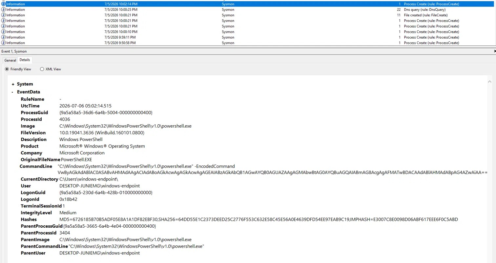
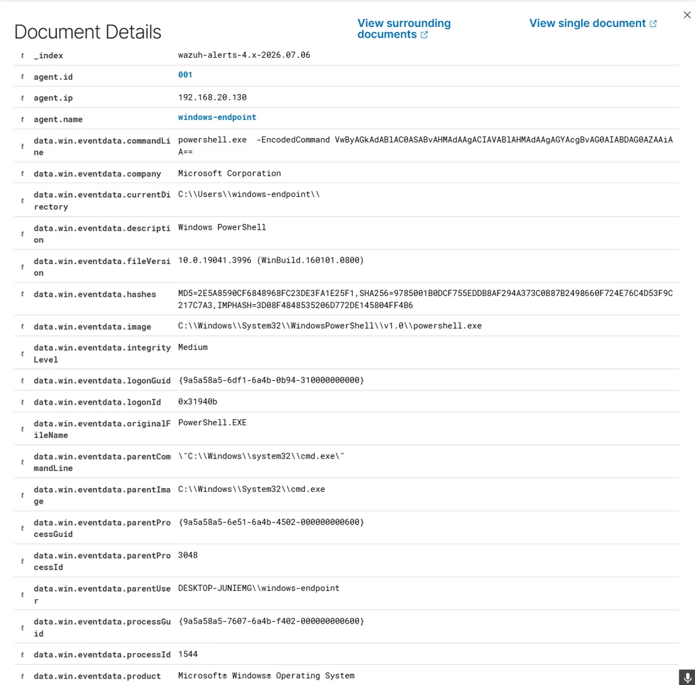
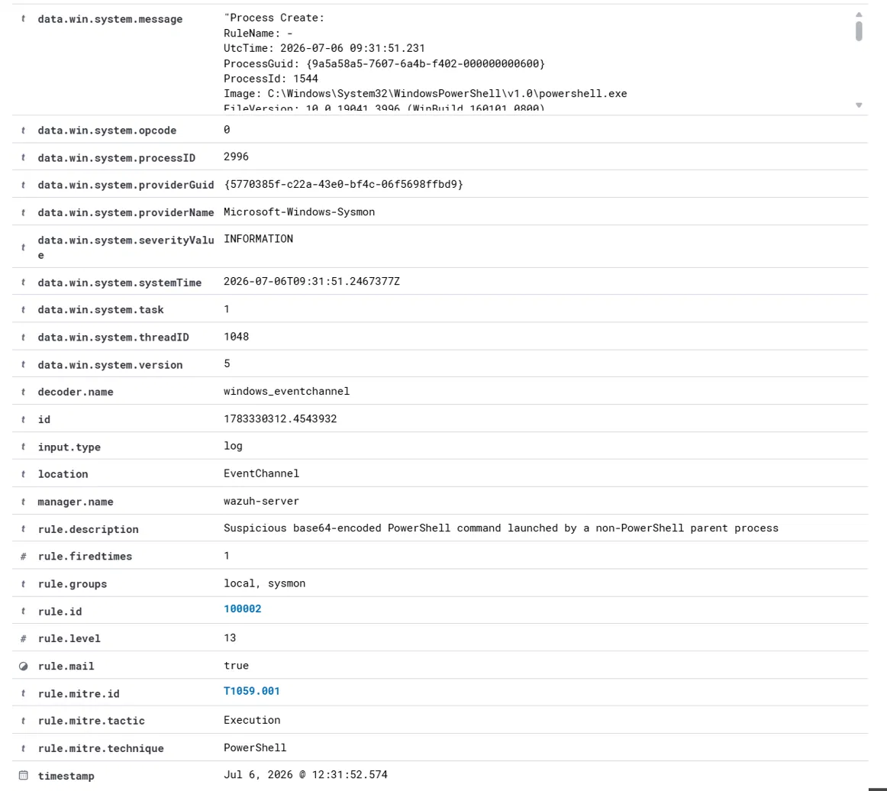

# Scenario 001: Suspicious PowerShell Encoded Command

## MITRE ATT&CK
**T1059.001** Command and Scripting Interpreter: PowerShell

## Behavior Simulated
A base64-encoded PowerShell command was executed via two different parent 
processes, to test detection coverage across both:

1. **PowerShell to PowerShell**: `powershell.exe -EncodedCommand ...` launched 
   from within another PowerShell session
2. **cmd.exe to PowerShell**: the same encoded flag, launched from Command 
   Prompt instead

Both commands decoded to a harmless `Write-Host` test string. No real 
payload was executed at any point.

## Why This Matters
Attackers base64-encode PowerShell commands to evade simple string-matching 
defenses and to smuggle multi-line or special-character payloads through a 
single command-line argument. The `-EncodedCommand` flag (and shorthand 
variants like `-enc`) is rarely used in legitimate day-to-day administration, 
making its presence a strong, well-established SOC indicator.

## Detection Gap Identified
Wazuh's built-in rule (`92057`) already detects base64-encoded PowerShell 
commands, but its logic requires the **parent process to also be 
PowerShell**:

```xml
<field name="win.eventdata.parentImage" type="pcre2">(?i)powershell\.exe</field>
```

Real attackers frequently launch encoded PowerShell from other processes 
instead, such as `cmd.exe`, `wscript.exe`, `cscript.exe`, `mshta.exe`, Office 
applications, or a scheduled task, none of which would trigger 92057, 
even with the exact same suspicious command line present.

## Custom Rule 100002
Extends detection to flag base64-encoded PowerShell execution launched 
from any of several known non-PowerShell parent processes (cmd.exe, 
wscript.exe, cscript.exe, mshta.exe, explorer.exe, wmiprvse.exe, winword.exe, 
excel.exe), closing the gap without duplicating 92057's existing coverage.

Full rule: [`detections/wazuh-rules/001-powershell-encoded-command.xml`](../../detections/wazuh-rules/001-powershell-encoded-command.xml)

## Raw Log Evidence

**PowerShell-parent variant** (caught by built-in rule 92057):



**cmd.exe-parent variant** (caught by custom rule 100002):





## Investigation Notes
In a real environment, an analyst reviewing this alert would check:
- **Parent process legitimacy**: is `cmd.exe` (or the relevant parent) 
  expected to be spawning PowerShell on this host? Check against baseline 
  behavior for the user and system.
- **Decoded command content**: base64-decode the payload to see what it 
  actually does. In this lab, it decoded to a harmless echo. In a real 
  incident, this step is critical.
- **User context**: was this triggered by an interactive user session, or 
  does it correlate with a scheduled task, remote login, or another alert, 
  such as a phishing-related process chain?
- **Time of day and frequency**: one-off encoded PowerShell during business 
  hours reads very differently than repeated occurrences at 3 AM.

## Timeline
| Time | Event |
|------|-------|
| T+0:00 | Encoded PowerShell executed via PowerShell parent |
| T+0:00 | Built-in rule 92057 fires (level 12) |
| T+30m | Encoded PowerShell executed via cmd.exe parent (gap test) |
| T+30m | No alert fires, confirming the coverage gap |
| n/a | Custom rule 100002 authored and deployed |
| T+45m | cmd.exe-parent test repeated |
| T+45m | Custom rule 100002 fires (level 13), gap closed |

## Response Actions (Simulated Case)
If this were a real alert:
1. Isolate the host from the network pending investigation
2. Base64-decode the command line to determine actual payload and intent
3. Check for related persistence artifacts, such as scheduled tasks, 
   registry run keys, or new services created around the same timestamp
4. Review authentication logs for the affected user around the same window
5. If confirmed malicious, initiate full incident response: credential 
   reset, host reimage consideration, and a broader IOC sweep across other hosts

## Lessons Learned and Rule Tuning Notes
Building rule 100002 required more iteration than expected. An initial 
version using a negated parent-process condition (`negate="yes"`) loaded 
without error but never matched live events, for reasons that were not 
fully resolved. Rebuilding the rule using an explicit allowlist of known 
non-PowerShell LOLBins, combined with a simplified command-line match, 
resolved it. Documented here as a reminder that Wazuh's negation logic 
did not behave as expected in this case, worth testing explicitly rather 
than assuming standard regex negation semantics apply cleanly.

## Incident Report Summary
**Case ID:** 001. **Severity:** High. **Status:** Detected and Contained (Lab). 
**Analyst:** Faisal Alomar **Date:** July 2026.

A base64-encoded PowerShell command was detected via two independent 
execution paths. Built-in detection covered one path (PowerShell-parent). 
A custom rule was engineered and validated to cover the second 
(non-PowerShell-parent), closing a real gap in default coverage. No actual 
malicious payload was present. This was a controlled detection engineering 
exercise. Recommend deploying rule 100002 to the production ruleset alongside 
92057 for full T1059.001 coverage.