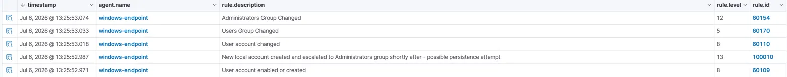
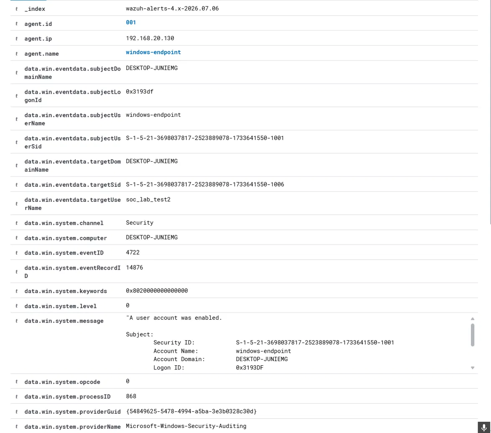
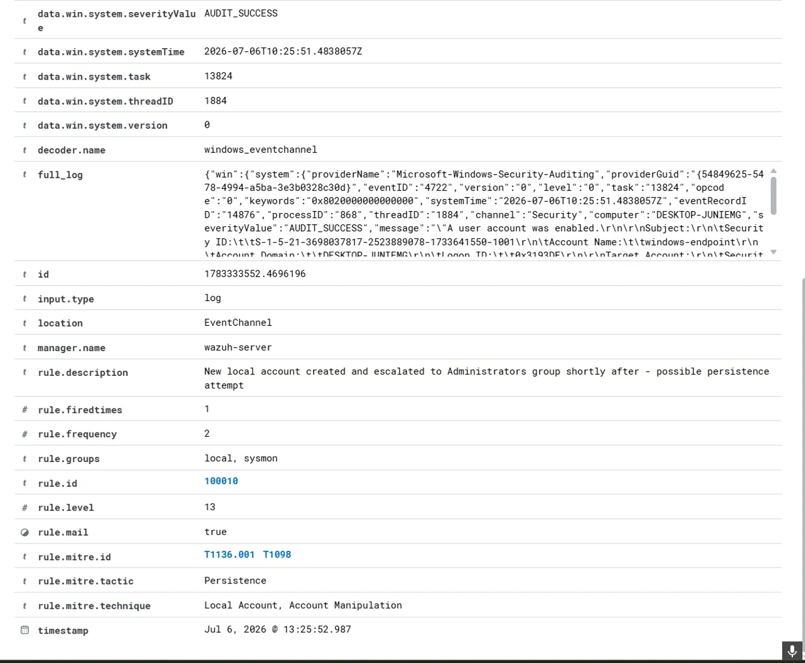

# Scenario 002: New Local Administrator Account Creation

## MITRE ATT&CK
T1136.001, Create Account: Local Account, and T1098, Account Manipulation.

## Behavior Simulated
A new local user account was created on the Windows endpoint, then 
immediately added to the local Administrators group, mirroring a classic 
persistence and privilege escalation pattern.

```
net user soc_lab_test2 P@ssw0rd123! /add
net localgroup administrators soc_lab_test2 /add
```

## Why This Matters
Creating a new local admin account is a common persistence technique. If an 
attacker gains temporary access, planting a backup admin account guarantees 
continued access even if the original foothold is closed. Attackers often 
name these accounts to blend in with legitimate service or admin accounts.

## Detection Gap Identified
Wazuh's built in rules already detect each individual step, rule 60109 
fires on account creation, and rule 60154 fires on the Administrators group 
change. Neither event alone is a strong signal, since legitimate admins 
create accounts and modify group membership regularly. The real indicator 
is the specific sequence, account creation immediately followed by 
escalation to Administrators.

## Custom Rule 100010
A correlation rule that fires when rule 60109, account created, is followed 
within 120 seconds by another matching event from the same agent, at a 
higher severity than either underlying event, reflecting the increased 
confidence of the combined pattern.

Full rule: [detections/wazuh-rules/002-local-admin-creation.xml](../../detections/wazuh-rules/002-local-admin-creation.xml)

Known limitation: this correlates on timing and agent alone, not on a 
strict same username match, since Windows Event IDs 4720 and 4732 name the 
relevant account in differently structured fields. In a real multi admin 
environment, a stricter same user correlation would be worth adding.

## Raw Log Evidence







## Investigation Notes
An analyst reviewing this alert would check who performed the action, 
whether the subject username matches an expected administrator or an 
unusual or shared account, whether there is business justification such as 
a change ticket for a new admin account at this time, whether the timing 
falls during business hours or an unusual time consistent with automated 
or unauthorized activity, and whether the account naming looks legitimate 
or resembles an attempt to blend in with a real service account.

## Timeline
| Time | Event |
|------|-------|
| T+0.000s | Account soc_lab_test2 created, Event ID 4722, rule 60109 |
| T+0.016s | Correlation rule 100010 fires, level 13 |
| T+0.033s | Account added to Users group, rule 60170 |
| T+0.087s | Account added to Administrators group, rule 60154 |

## Response Actions (Simulated Case)
Verify immediately whether the account creation was authorized. If 
unauthorized, disable the account and remove it from Administrators. Review 
the subject account's recent activity for signs of compromise. Check for 
other new accounts created around the same time on other hosts. Reset 
credentials for the account that performed the creation, if it appears 
compromised.

## Lessons Learned and Rule Tuning Notes
This correlation rule worked correctly on the first attempt, unlike several 
other rules built in this project. The main design tradeoff was accepting 
a timing based correlation instead of a strict username match, due to 
differing field names between the two underlying Windows event types. This 
is documented as a known limitation rather than treated as fully solved.

## Incident Report Summary
**Case ID:** 002. **Severity:** Critical. **Status:** Detected and Contained (Lab). 
**Analyst:** Faisal Alomar **Date:** July 2026.


A new local account was created and escalated to the Administrators group 
within under 100 milliseconds, a pattern consistent with automated 
persistence tooling rather than manual administration. Correlation rule 
100010 successfully detected the sequence at a higher severity than either 
underlying event alone. Recommend deploying to production and considering 
a stricter same user correlation for multi admin environments.