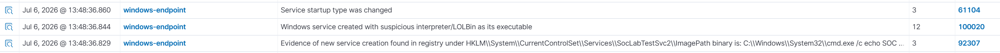
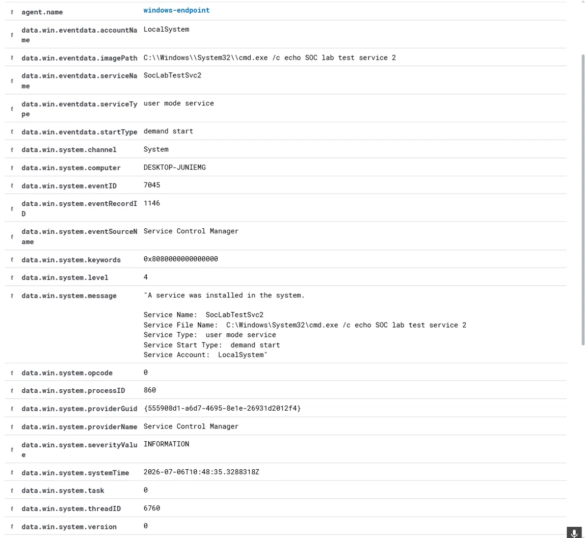
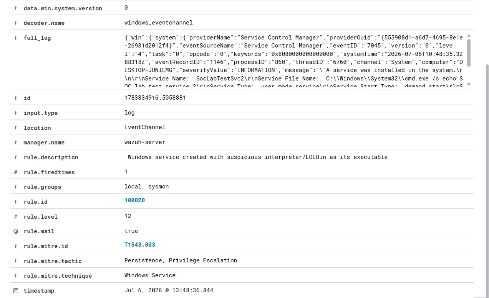

# Scenario 003: Suspicious Windows Service Creation

## MITRE ATT&CK
T1543.003, Create or Modify System Process: Windows Service.

## Behavior Simulated
A new Windows service was created pointing directly at cmd.exe as its 
executable, mirroring how attackers often use a legitimate system binary 
or LOLBin as the launch target for a persistence mechanism.

```
sc create SocLabTestSvc2 binPath= "C:\Windows\System32\cmd.exe /c echo SOC lab test service 2" start= demand
```

## Why This Matters
Creating a new Windows service is a common persistence and privilege 
escalation technique. Services run with SYSTEM level privileges by default 
and start automatically on boot, giving an attacker both reliable reboot 
survival and elevated execution context. It is also frequently used to 
launch a malicious binary disguised behind a legitimate sounding service 
name.

## Detection Gap Identified
Wazuh's built in rule 61138 fires on any new service creation, Event ID 
7045, but only checks that the event occurred. It does not look at what 
the service actually launches, so a completely legitimate software 
installer creating a service produces the same low severity alert as a 
service pointing directly at cmd.exe, powershell.exe, or another known 
LOLBin.

## Custom Rule 100020
Chains off rule 61138 and adds a check on the service's imagePath field, 
escalating severity specifically when the executable is a known 
interpreter or LOLBin such as cmd.exe, powershell.exe, rundll32.exe, 
mshta.exe, wscript.exe, or cscript.exe.

Full rule: [detections/wazuh-rules/003-suspicious-service-creation.xml](../../detections/wazuh-rules/003-suspicious-service-creation.xml)

## Raw Log Evidence







## Investigation Notes
An analyst reviewing this alert would check whether the service name and 
executable path match a known legitimate application, whether the account 
running the service is expected to be LocalSystem or something else, 
whether the service was set to start automatically or on demand, and 
whether this event correlates with any other recent activity on the host 
such as a suspicious download or process execution.

## Timeline
| Time | Event |
|------|-------|
| T+0.000s | Service SocLabTestSvc2 created via sc create, Event ID 7045 |
| T+0.000s | Built in rule 61138 fires, level 5 |
| T+0.000s | Custom rule 100020 fires, level 12 |
| T+0.015s | Registry based FIM rule 92307 fires independently, confirming the same change via a separate detection mechanism |
| T+0.016s | Service startup type change logged, rule 61104 |

## Response Actions (Simulated Case)
Immediately review the service's binPath to determine what it actually 
executes. If it points to an interpreter or unexpected binary, disable or 
delete the service pending investigation. Check for related persistence 
artifacts such as scheduled tasks or startup folder entries created around 
the same time. Review the account context the service was configured to 
run under. If confirmed malicious, treat as a likely persistence mechanism 
and expand the investigation to check for lateral movement.

## Lessons Learned and Rule Tuning Notes
This rule worked correctly on the first attempt. A useful secondary finding 
was that the same event was independently caught by a completely separate 
detection mechanism, Wazuh's File Integrity Monitoring watching the 
relevant registry key, alongside the event log based rule. This is a good 
real world example of defense in depth, where the same malicious action is 
visible through more than one detection layer.

## Incident Report Summary
**Case ID:** 003. **Severity:** High. **Status:** Detected and Contained (Lab). 
**Analyst:** Faisal Alomar **Date:** July 2026.

A new Windows service was created pointing directly at cmd.exe, a known 
LOLBin. The built in ruleset detected the service creation itself but did 
not distinguish it from a benign software install. Custom rule 100020 
correctly escalated the alert based on the suspicious executable path, and 
the same activity was independently confirmed via registry based File 
Integrity Monitoring. Recommend deploying rule 100020 to production 
alongside the existing FIM policy for layered coverage.