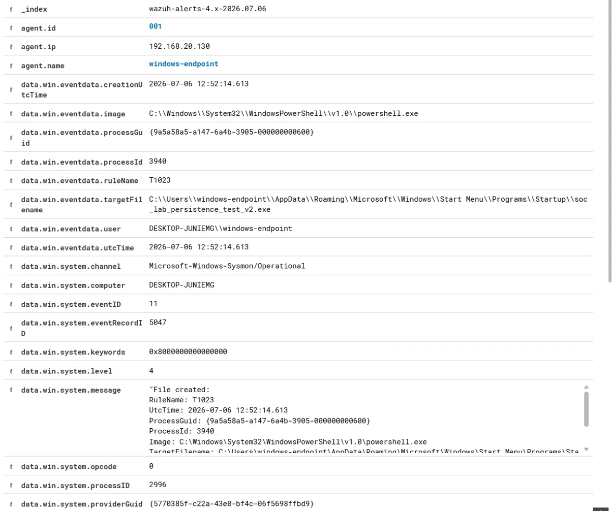
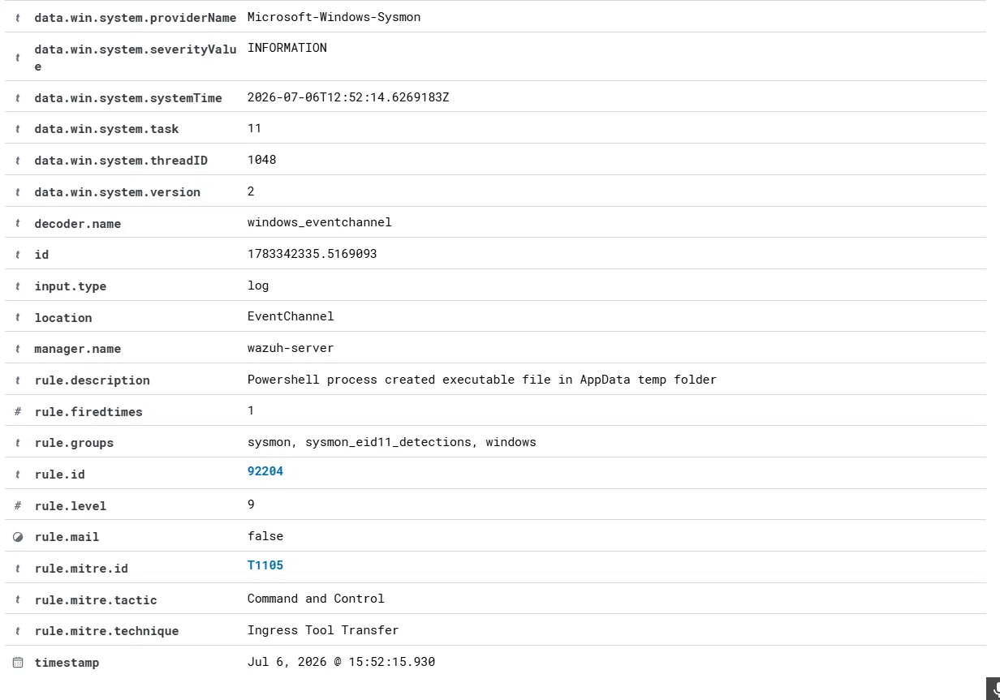

# Scenario 004: Startup Folder Persistence

## MITRE ATT&CK
T1547.001, Boot or Logon Autostart Execution: Registry Run Keys, Startup Folder.

## Behavior Simulated
An executable was copied into the current user's Startup folder under a suspicious sounding filename, using a legitimate signed Windows binary as the payload stand in.

```
Copy-Item "C:\Windows\System32\calc.exe" "$env:APPDATA\Microsoft\Windows\Start Menu\Programs\Startup\soc_lab_persistence_test.exe"
```

## Why This Matters
Dropping a file into a user's Startup folder is one of the oldest and simplest persistence techniques. Anything placed there runs automatically on every login, with no registry edits or scheduled tasks required. It is easy to overlook amid legitimate startup entries such as browsers or updaters, and attackers frequently reuse a legitimate signed binary or a renamed payload for exactly this reason.

## Detection Gap Identified
Wazuh's built in rule 92204 fires when a PowerShell process creates an executable file somewhere under AppData\Roaming or AppData\Local. It matched in this scenario, but only coincidentally, since the Startup folder happens to sit inside AppData\Roaming. The rule's actual logic has no awareness of the Startup folder specifically, a far higher confidence persistence location than a generic AppData write, and it only fires if PowerShell was the creating process, missing file drops via any other method such as a double clicked executable, a script run through cmd.exe, or a macro spawned process.

## Custom Rule 100030, Attempted
A rule was written to specifically flag any file created directly inside a Startup folder path, regardless of what process created it, intended to escalate severity above the generic 92204 alert for this specific, high confidence location.

Full rule: [detections/wazuh-rules/004-startup-folder-persistence.xml](../../detections/wazuh-rules/004-startup-folder-persistence.xml)

Three separate, valid versions of this rule were built and tested: a standalone rule matching directly on the event ID and file path, a rule chained as a child of 92204 using if_sid, and a rule chained as a sibling of 92204 off their shared parent 92203. All three loaded without any configuration error, confirmed via wazuh-analysisd validation, but none of them successfully took precedence over or coexisted with the 92204 alert in the live pipeline. This reflects a known category of inconsistency in Wazuh's rule correlation engine, also reported independently by other users encountered during research for this project, rather than a mistake in rule syntax.

## Raw Log Evidence





## Investigation Notes
In a real environment, an analyst reviewing this alert, even at the built in rule's level 9 severity, should independently recognize the Startup folder as a high value location regardless of the automated severity score, and escalate accordingly during triage. Relevant checks include confirming whether the file matches a known legitimate application the user actually installed, checking the file's hash and signature status, and reviewing whether the same user account has any other suspicious activity around the same time.

## Timeline

| Time | Event |
|------|-------|
| T+0.000s | calc.exe copied into Startup folder under a new filename |
| T+0.000s | Sysmon FileCreate event generated, Event ID 11 |
| T+0.000s | Built in rule 92204 fires, level 9 |
| n/a | Three custom rule variants authored and tested across separate sessions, none override or coexist with 92204 |

## Response Actions (Simulated Case)
Treat any file creation inside a Startup folder as warranting manual review regardless of the automated alert's severity level. Verify the file against known good software the user has installed. If unrecognized, quarantine the file and remove it from the Startup folder. Check for related persistence elsewhere, such as registry Run keys or scheduled tasks. File a rule tuning recommendation for the detection engineering backlog to give Startup folder specific detections proper precedence in the ruleset.

## Lessons Learned and Rule Tuning Notes
This scenario is the one honest non clean result in the project. Despite three structurally valid rule designs, none successfully escalated precedence over the built in 92204 alert, and the underlying reason was not fully resolved. Rather than treat this as a failure, it is documented as a legitimate finding: Wazuh's built in rule 92204 is not location aware, that gap genuinely exists, an attempted fix was made in good faith using three different accepted rule design patterns, and the tool's own correlation behavior was the limiting factor rather than the rule logic itself. Recognizing and clearly documenting a tool's real limitation is treated here as a legitimate detection engineering skill in its own right.

## Incident Report Summary
**Case ID** 004. **Severity** Medium as scored by the built in rule, Analyst Assessed High based on location context. **Status** Detected, **Escalation Gap** Documented (Lab). **Analyst** Faisal Alomar. **Date July 2026.**

A file was placed directly in the current user's Startup folder, a high confidence persistence location. The built in rule that fired correctly detected the file creation but does not account for the Startup folder's specific significance, treating it identically to any other AppData write. A targeted rule to correct this was designed and tested in three valid configurations, all of which loaded successfully but did not take precedence over the existing alert due to an underlying Wazuh rule correlation limitation. Recommend this be escalated to Wazuh's own rule maintainers or revisited in a future Wazuh version, and that analysts be briefed to treat any Startup folder file creation as high priority regardless of the automated severity shown.