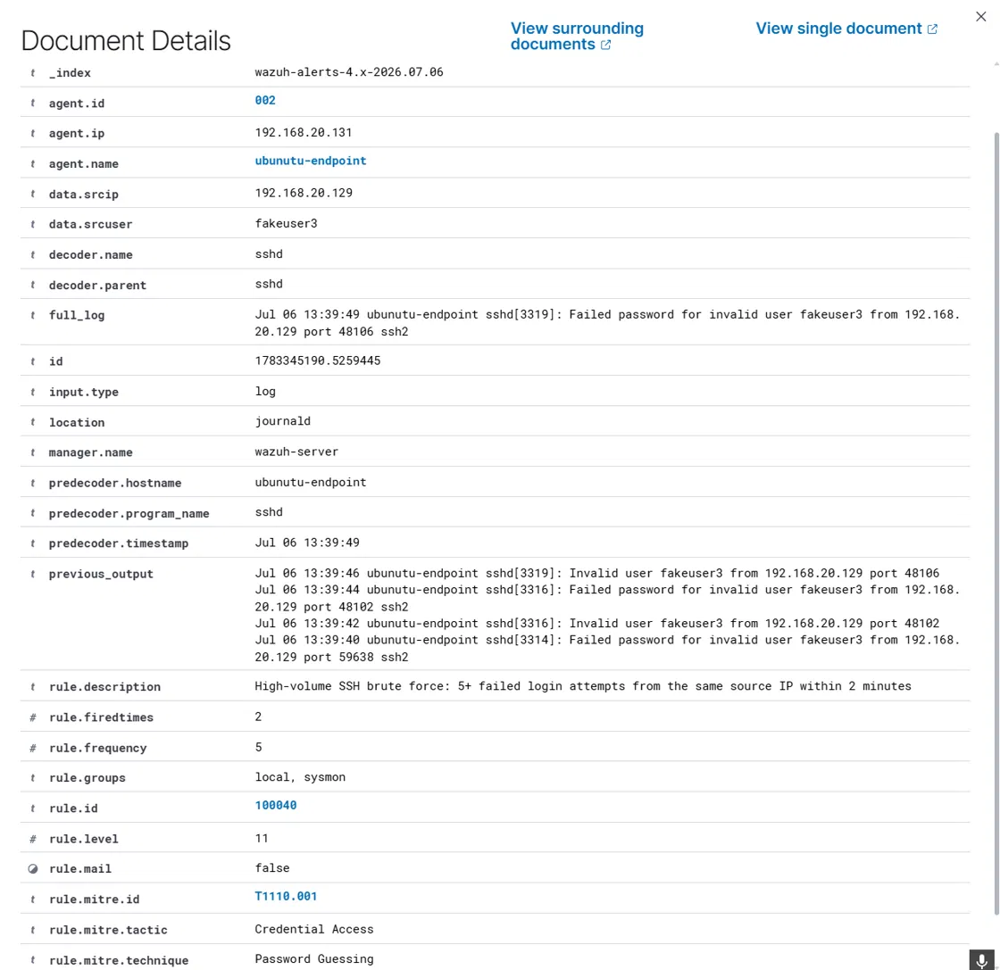

# Scenario 005: SSH Brute Force (Linux)

## MITRE ATT&CK
T1110.001, Brute Force: Password Guessing.

## Behavior Simulated
A series of failed SSH login attempts using an invalid username were sent to the Ubuntu endpoint from a known source IP, followed by a genuine successful login from the same source, mirroring the classic pattern of an automated brute force scan that eventually succeeds.

```
for i in {1..7}; do sshpass -p "wrongpassword$i" ssh -o StrictHostKeyChecking=no -o ConnectTimeout=3 fakeuser3@192.168.20.131 exit; sleep 1; done
```

## Why This Matters
SSH brute forcing is one of the most common attack patterns against any internet facing Linux server, since automated bots constantly scan for exposed SSH ports and attempt credential guessing. Detecting a burst of failed logins from the same source, especially one followed by a success, is a foundational SOC detection.

## Detection Coverage Found
Unlike the other scenarios in this project, Wazuh's built in ruleset already provides strong, layered coverage here. Rule 5710 fires on each individual failed login attempt using a non existent user. Rule 5551 escalates when multiple failed logins occur in a short period. Rule 40112 is a purpose built correlation rule that fires specifically when authentication failures are followed by a success from the same source IP, closely matching the exact pattern this scenario simulates.

A genuine gap was still found on closer inspection. Rule 40112 has no frequency threshold configured, meaning its logic technically fires after just one failed login followed by a success, a very common and largely benign pattern such as a user mistyping their password once. This means the rule's description, multiple authentication failures followed by a success, is not actually enforced by its own logic.

## Custom Rule 100040
Rather than modify 40112 directly, a separate rule was added to specifically flag high volume failures, five or more within two minutes from the same source IP, independent of whether a success ever follows. This distinguishes a low signal single mistyped password from a genuine automated brute force attempt, and remains useful even in cases where an attack never succeeds.

Full rule: [detections/wazuh-rules/005-linux-ssh-bruteforce.xml](../../detections/wazuh-rules/005-linux-ssh-bruteforce.xml)

An initial version of this rule was built on the same if_group and if_matched_group chain used by 40112, but it did not fire, consistent with a pattern also observed in Scenario 4, where rules sharing an existing chain with a built in rule appear to compete rather than coexist. Rewriting the rule to chain instead off rule 5710 directly, a separate branch of the ruleset, resolved this.

The rule's severity level was deliberately set to 11, positioned between the existing rule 5551 at level 10 and rule 40112 at level 12, reflecting that high volume failures without a confirmed success are more significant than generic frequency alone, but less severe than a confirmed successful compromise.

## Raw Log Evidence



The following raw log excerpt was captured directly from /var/log/auth.log on the Ubuntu endpoint, showing the complete sequence from repeated failures through to the final accepted login.

```
2026-07-06T13:22:47.265862+00:00 ubunutu-endpoint sshd[2935]: pam_unix(sshd:auth): check pass; user unknown
2026-07-06T13:22:47.265924+00:00 ubunutu-endpoint sshd[2935]: pam_unix(sshd:auth): authentication failure; logname= uid=0 euid=0 tty=ssh ruser= rhost=192.168.20.129
2026-07-06T13:22:49.474621+00:00 ubunutu-endpoint sshd[2935]: Failed password for invalid user fakeuser from 192.168.20.129 port 38432 ssh2
2026-07-06T13:22:51.025804+00:00 ubunutu-endpoint sshd[2935]: Connection closed by invalid user fakeuser 192.168.20.129 port 38432 [preauth]
2026-07-06T13:22:52.128734+00:00 ubunutu-endpoint sshd[2937]: Invalid user fakeuser from 192.168.20.129 port 53160
2026-07-06T13:22:54.358996+00:00 ubunutu-endpoint sshd[2937]: Failed password for invalid user fakeuser from 192.168.20.129 port 53160 ssh2
2026-07-06T13:22:56.993503+00:00 ubunutu-endpoint sshd[2939]: Invalid user fakeuser from 192.168.20.129 port 53168
2026-07-06T13:22:59.439491+00:00 ubunutu-endpoint sshd[2939]: Failed password for invalid user fakeuser from 192.168.20.129 port 53168 ssh2
2026-07-06T13:26:00.028325+00:00 ubunutu-endpoint sshd[2991]: Accepted password for ubuntuadmin from 192.168.20.129 port 43592 ssh2
2026-07-06T13:26:00.029525+00:00 ubunutu-endpoint sshd[2991]: pam_unix(sshd:session): session opened for user ubuntuadmin(uid=1000) by ubuntuadmin(uid=0)
```

## Investigation Notes
An analyst reviewing this alert would check whether the source IP is internal or external, since an internal source may indicate a compromised host on the network rather than an outside scanner. The specific usernames attempted are worth reviewing to determine whether they suggest a targeted attempt against known accounts or a generic automated scan. The account that eventually succeeded, if any, should be checked for whether its password is now considered compromised and in need of rotation. The volume and timing of attempts help distinguish an automated tool from a manual guessing attempt.

## Timeline

| Time | Event |
|------|-------|
| T+0:00 | First failed login attempt, invalid user, rule 5710 |
| T+0:02 to T+0:12 | Six additional failed attempts logged, same source IP |
| T+0:11 | Rule 5551, multiple failed logins in a short period, fires at level 10 |
| T+0:11 | Custom rule 100040 fires at level 11, five plus failures from the same source IP |
| T+3:13 | Successful login from the same source IP using valid credentials |
| T+3:13 | Built in rule 40112, failures followed by a success, fires at level 12 |

## Response Actions (Simulated Case)
Block or rate limit the source IP at the network or firewall level. Force a password reset for any account that had a successful login following a failure burst from the same source. Review whether SSH is exposed beyond what is necessary, and consider key based authentication or a bastion host if this is an internet facing system. Check for any other hosts receiving similar traffic from the same source IP.

## Lessons Learned and Rule Tuning Notes
This scenario differed from the others in that the built in ruleset already provided strong, well designed coverage, including a dedicated failures then success correlation rule. Rather than force an unnecessary rewrite, the finding here was a specific, narrow gap: the built in correlation rule's frequency threshold was not actually enforced despite its description implying one. The custom rule built to address high volume failures independently of a success also confirmed, for a second time in this project, that Wazuh rules sharing an existing chain with another matching rule can fail to coexist as expected, resolved here by chaining off a different rule entirely. Severity was assigned deliberately relative to neighboring existing rules rather than copied from an unrelated one.

## Incident Report Summary
**Case ID 005.** **Severity** High. **Status** Detected and Contained (Lab). **Analyst** Faisal Alomar. **Date July 2026.**

A brute force pattern against SSH was simulated and successfully detected by Wazuh's existing ruleset, including a purpose built correlation rule for failures followed by a success. A secondary gap was identified in that rule's lack of an enforced frequency threshold, and a complementary rule was built to independently flag high volume failure activity regardless of eventual success. Recommend deploying rule 100040 alongside the existing ruleset, and separately recommend the security team consider adding an explicit frequency threshold to rule 40112 itself.